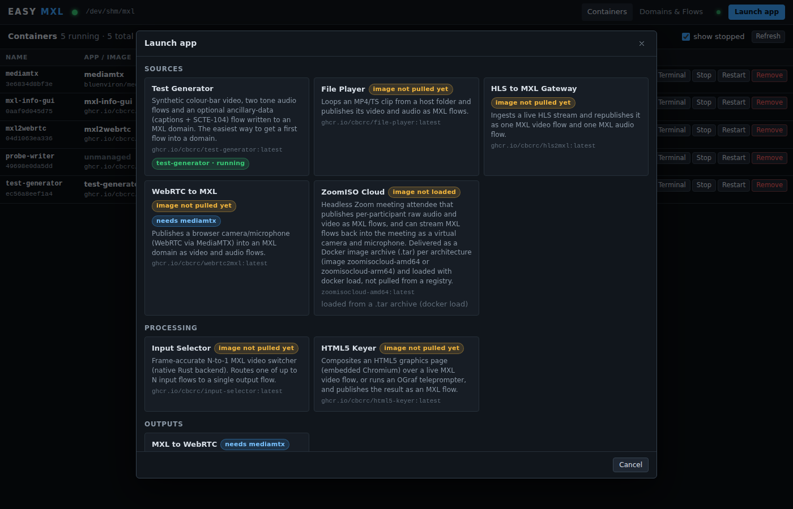

<p align="center">
  
</p>

<p align="center">
  <a href="https://github.com/CLOUDflex-broadcast/easy-mxl/actions/workflows/ci.yml"></a>
  <a href="https://github.com/CLOUDflex-broadcast/easy-mxl/releases/latest"></a>
  <a href="https://github.com/CLOUDflex-broadcast/easy-mxl/pkgs/container/easy-mxl"></a>
  <a href="https://cloudflex-broadcast.github.io/easy-mxl/"></a>
  <a href="LICENSE"></a>
</p>

**EASY MXL** turns any Ubuntu box with Docker into a working [MXL](https://github.com/dmf-mxl/mxl)
(EBU Dynamic Media Facility, Media eXchange Layer) system in minutes. It creates MXL domains in
shared memory, launches the DMF-MXL media functions as containers, opens their web interfaces
and shows you every flow in the domain live: who writes it, how far behind it is, and whether
it is still alive. Logs and a terminal for each container are one click away.

No YAML, no compose files, no SDK build. One install command, one browser tab.

## Install

On Ubuntu 22.04 / 24.04, as a user with sudo:

```sh
curl -fsSL https://github.com/CLOUDflex-broadcast/easy-mxl/releases/latest/download/install.sh | sudo bash
```

The installer adds Docker Engine and Node.js 22 when they are missing, installs the latest
release to `/opt/easy-mxl`, starts the `easy-mxl` service on port 9700 and prints the URL and
a random API token. Open `http://<host>:9700`, enter the token, create a domain, launch the
**Test Generator**, press **Open UI** and start its pipeline. Your first MXL flows appear under
**Domains & Flows**.

Other ways to run it: the container image `ghcr.io/cloudflex-broadcast/easy-mxl`, or from
source (`npm ci && npm run build && npm start`). Details, options and upgrades are in the
[documentation](https://cloudflex-broadcast.github.io/easy-mxl/getting-started/).

<p align="center">
  
</p>

## What you get

- **Domains in shared memory.** Create an MXL domain (a directory on tmpfs with its
  `domain_def.json`) in one click and bind-mount it into any container. A missing or broken
  definition is repaired with one button.
- **Every flow, live.** Group, role, label, format, head index, latency (matching `mxl-info`),
  active / inactive / stale status and the container that writes it, detected from the
  writers' file locks on the host.
- **The DMF-MXL apps, ready to launch.** Test Generator, MXL Info GUI, MXL to WebRTC (with
  MediaMTX), File Player, HLS to MXL, Input Selector, HTML5 Keyer, WebRTC to MXL, the
  hands-on writer, reader and clip player. Pick a domain and a host port,
  and EASY MXL pulls the image, wires the mounts and environment, resolves dependencies and
  opens the UI.
- **Container operations.** Start, stop, restart, remove, live logs and an in-browser
  terminal for every container on the host, not only the ones EASY MXL started.
- **Locally delivered images.** Apps shipped as a `.tar` are supported with
  a tag picker instead of a registry pull.
- **Your own catalog.** Add media functions with a small JSON file: image, ports, domain
  mount, environment, parameters, named volumes, dependencies.

<p align="center">
  
</p>

## How it works

An MXL domain is a directory on a tmpfs filesystem; flows are memory-mapped files inside it.
EASY MXL keeps domains under `/dev/shm/mxl/<name>` and bind-mounts them into containers at
the path each app expects (`/mxl-domain` for the GStreamer apps, `/domain` for the hands-on
writer and reader). It reads each flow's `flow_def.json` and binary header directly, finds
the writer's `flock()` in `/proc/locks` and maps that PID to a container through
`/proc/<pid>/cgroup`. Everything runs as one Node.js process talking to the Docker socket;
there is no database.

```
 browser  ──HTTP/WS──▶  EASY MXL  ──/var/run/docker.sock──▶  Docker Engine
                           │                                     │
                           ├─ /dev/shm/mxl/<domain>/*.mxl-flow ◀─┤ bind mounts
                           └─ /proc/locks, /proc/<pid>/cgroup    │ media-function containers
```

Read more: [How it works](https://cloudflex-broadcast.github.io/easy-mxl/how-it-works/),
[Apps and catalog](https://cloudflex-broadcast.github.io/easy-mxl/apps/),
[Configuration and security](https://cloudflex-broadcast.github.io/easy-mxl/configuration/),
[HTTP API](https://cloudflex-broadcast.github.io/easy-mxl/api/),
[Troubleshooting](https://cloudflex-broadcast.github.io/easy-mxl/troubleshooting/).

## Requirements

- Ubuntu 24.04 (22.04 works) with Docker Engine; the installer can add Docker.
- Node.js 20 or newer (22 recommended); the installer can add it.
- Network access to `ghcr.io` for the app images. `python3` is optional and gives an exact
  TAI offset for latency figures.

EASY MXL controls the Docker daemon, which is root-equivalent. It binds to `127.0.0.1` by
default; the installer's service binds to all interfaces with a token, and browser requests
from other origins are rejected. Put a TLS reverse proxy in front for anything beyond a lab
network. See [Configuration](https://cloudflex-broadcast.github.io/easy-mxl/configuration/).

## Development

```sh
git clone https://github.com/CLOUDflex-broadcast/easy-mxl.git && cd easy-mxl
npm ci
npm test              # build + unit tests, no Docker needed
npm run dev           # rebuild on change and restart
```

TypeScript compiled by `tsc` to `dist/`, Express 5, `ws`, `dockerode`, a vanilla frontend with
xterm.js; no framework, no bundler. The [design contract](docs/DESIGN.md) documents every
module and endpoint. Contributions are welcome: see [CONTRIBUTING.md](CONTRIBUTING.md) and
[SECURITY.md](SECURITY.md).

## Acknowledgements

EASY MXL builds on the [MXL SDK](https://github.com/dmf-mxl/mxl) by the EBU Dynamic Media
Facility community and on the media-function containers and exercises of
[CBC/Radio-Canada's mxl-hands-on](https://github.com/cbcrc/mxl-hands-on). WebRTC relaying uses
[MediaMTX](https://github.com/bluenviron/mediamtx).

## License

[MIT](LICENSE).
