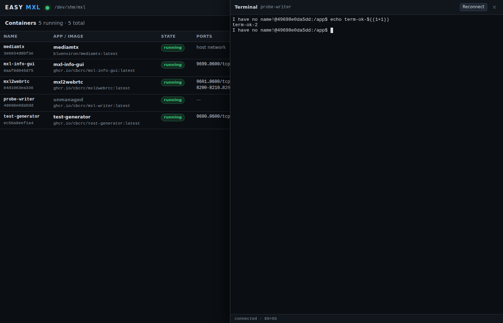

# Apps

The built-in catalog mirrors the compose files of
[mxl-hands-on exercise 4](https://github.com/cbcrc/mxl-hands-on/blob/main/docker/exercise-4/docker-compose.yml)
and exercises 1-3,; the launch dialog turns each entry into a running
container with the right mounts, ports and dependencies.

## The built-in catalog

All FastAPI apps serve their UI and Swagger (`/docs`) on container port 9600. The catalog is
`catalog/default.json` in the repository.

| id | Name | Image | Ports (host -> container) | Category | Domain mount / notes |
|---|---|---|---|---|---|
| `test-generator` | Test Generator | `ghcr.io/cbcrc/test-generator:latest` | 9600 -> 9600 | source | `/mxl-domain` rw |
| `mxl-info-gui` | MXL Info GUI | `ghcr.io/cbcrc/mxl-info-gui:latest` | 9699 -> 9600 | monitoring | `/mxl-domain` ro |
| `mediamtx` | MediaMTX (WebRTC relay) | `bluenviron/mediamtx:latest` | host network (8554, 8889, 8189/udp) | infrastructure | no domain, no UI; auto-launched by the WebRTC apps |
| `mxl2webrtc` | MXL to WebRTC | `ghcr.io/cbcrc/mxl2webrtc:latest` | 9601 -> 9600, 8200-8210/udp | output | `/mxl-domain` ro; requires `mediamtx`; installs x264 on first start |
| `file-player` | File Player | `ghcr.io/cbcrc/file-player:latest` | 9602 -> 9600 | source | `/mxl-domain` rw; host clips folder -> `/home/file` ro (required); installs `gstreamer1.0-libav` on first start |
| `hls2mxl` | HLS to MXL Gateway | `ghcr.io/cbcrc/hls2mxl:latest` | 9603 -> 9600 | source | `/mxl-domain` rw |
| `input-selector` | Input Selector | `ghcr.io/cbcrc/input-selector:latest` | 9604 -> 9600 | processing | `/mxl-domain` rw; param `maxInputs` (default 3) |
| `html5-keyer` | HTML5 Keyer | `ghcr.io/cbcrc/html5-keyer:latest` | 9605 -> 9600 | processing | `/mxl-domain` rw; `shm_size` 1 GB; param `defaultMode` (`key` / `prompt`) |
| `webrtc2mxl` | WebRTC to MXL | `ghcr.io/cbcrc/webrtc2mxl:latest` | 9606 -> 9600 | source | `/mxl-domain` rw; requires `mediamtx` |
| `mxl-writer` | Test Writer (mxl-gst-testsrc) | `ghcr.io/cbcrc/mxl-writer:latest` | - | tools | `/domain` rw, user 1000:1000; params `groupHint`, `overlayText`; fixed flow ids, one instance per domain |
| `mxl-reader` | Reader / mxl-info shell | `ghcr.io/cbcrc/mxl-reader:latest` | - | tools | `/domain` ro, user 1000:1000; open a terminal and run `/app/mxl-info -d /domain -l` |
| `mxl-clip-player` | Clip Player (looping filesrc) | `ghcr.io/cbcrc/mxl-clip-player:latest` | - | tools | `/domain` rw; host clip file -> `/app/clip.ts` ro (required); runs as root, installs `gstreamer1.0-libav` on first start |


Details on how each of the CBC/Radio-Canada apps works are in the hands-on
[gst-apps README](https://github.com/cbcrc/mxl-hands-on/blob/main/gst-apps/README.md). The
apps marked "installs ... on first start" fetch a package from the Ubuntu archive when their
container starts for the first time, so that container needs network access once.

!!! note
    The `ghcr.io/cbcrc/*` images are published for `linux/amd64`. On an arm64 host Docker
    needs `qemu-user-static` / binfmt emulation to run them.

## Launching an app

**Launch app** in the top bar (or **Launch app here** on a domain) opens the launch dialog.

1. **Pick an app.** Cards are grouped by category and show the image, a badge when the image
   is not pulled yet (*image not loaded* for locally loaded images) and the state of an
   existing container of that app.
2. **Fill the form.**
    - **Domain** - lists the domains under the domain root; **+ create domain...** creates one
      inline. Directories without a `domain_def.json` are listed but cannot be selected until
      they are fixed under Domains & Flows.
    - **Container name** - pre-filled from the catalog; letters, digits, `_`, `.` and `-`.
    - **Host ports** - pre-filled from the catalog. Each port is checked through
      `/api/ports/check` while you type: *in use by `<container>`* when another container
      publishes it, *port is already listening on this host* when some other process has it
      bound. Change the port or stop the other process.
    - **Host paths** - for apps that mount a host file or folder (File Player's clips folder,
      Clip Player's `.ts` file). Required paths must be absolute; `/`, `/etc`, `/proc`,
      `/sys`, `/dev`, `/boot` and the Docker socket are refused.
    - **Parameters** - the app's template values (group hint, overlay text, number of input
      slots, keyer mode, timezone).
    - **Also launch required apps** - checked by default for apps with dependencies such as
      `mediamtx`.
    - **Advanced** - *Extra environment* (`KEY=VALUE` lines, merged over the app defaults)
      and *Pull policy* (pull only when the image is missing, or always pull before starting).
      For locally loaded images the pull policy is replaced by an **Image** select listing the
      loaded tags.
3. **Launch.** The dialog follows the job: pull progress per layer, dependency steps,
   container creation and start. When it is done an **Open UI** button appears.

Dependencies (`requires` in the catalog) are resolved first, in the same domain: a running
container of the required app is reused, a stopped one is started, a missing one is launched
with its defaults. That is how MediaMTX comes up automatically for MXL to WebRTC and WebRTC to
MXL.

If a container of the chosen name already exists - typically from the hands-on
`docker compose` stack - the launch stops with `name_conflict` and the dialog offers
**Start existing** (reuse that container as it is) or **Remove & relaunch** (delete it and
create a fresh one from the catalog entry).

After launch the container appears under **Containers** with **Open UI** (opens
`http://<the host name you opened EASY MXL on>:<host port><path>` in a new tab), **API docs**
(Swagger), **Logs**, **Terminal**, **Start / Stop / Restart** and **Remove**. Containers
launched by EASY MXL carry `easy-mxl.*` labels; containers started any other way are listed
and manageable too, their domain is inferred from mounts under the domain root.



!!! tip
    When EASY MXL itself runs in a container, `/api/ports/check` probes ports from inside that
    container, so the "already listening on this host" hint only reflects the EASY MXL
    container. The container-binding check (which app publishes the port) still works.

## Adding your own apps

A catalog file is a JSON array of app objects. Extra files are loaded after the built-in one
(`--catalog my-apps.json`, repeatable, or `EASY_MXL_CATALOG=/a.json:/b.json`); an entry with an
existing `id` replaces the built-in entry and `"disabled": true` hides one. Under systemd put
the path in `/etc/default/easy-mxl` (`EASY_MXL_CATALOG=/etc/easy-mxl/catalog.json`) and restart
the service; in the container route bind-mount the file and pass the variable with `-e`.
Catalog files are validated at start-up; an unreadable file or an invalid entry stops EASY MXL
with a message that names the file and the entry.

Fields (only `id`, `name`, `image` are required):

| Field | Meaning |
|---|---|
| `id` | `^[a-z0-9][a-z0-9-]*$`, unique |
| `name`, `description`, `category` | shown in the launch dialog; category is one of `source`, `processing`, `output`, `monitoring`, `infrastructure`, `tools` |
| `image` | image reference; `:latest` is assumed when no tag is given |
| `imagePolicy` | `pull` (default) or `local` for images loaded with `docker load`: never pulled, the launch dialog lists the loaded tags of `imageRepository` and the chosen one is sent as `image` |
| `imageRepository`, `imageRepositories` | repository (or list of repositories, e.g. one per CPU architecture) whose loaded tags are offered; default: `image` without tag/digest |
| `containerName` | default container name (the dialog lets you change it) |
| `webUI` | `{ "containerPort": 9600, "path": "/", "docsPath": "/docs" }`; enables **Open UI** / **API docs** |
| `ports[]` | `{ "containerPort", "hostPort", "protocol", "rangeEnd"? }` with protocol `tcp` or `udp`; `rangeEnd` publishes a range with the same offset |
| `domainMount` | `{ "containerPath": "/mxl-domain", "readOnly": false, "envVar": "MXL_DOMAIN" }`; the selected domain is bind-mounted there and, when `envVar` is set, its container path exported under that name |
| `env` | `{ "KEY": "value" }`; values may use `{{param}}` placeholders and the built-ins `{{containerName}}`, `{{domainName}}`, `{{domainContainerPath}}` |
| `params[]` | `{ "key", "label", "default", "help" }` template values, editable in the dialog |
| `hostPaths[]` | `{ "key", "label", "containerPath", "readOnly", "required", "default" }` host files or directories to bind-mount (`/`, `/etc`, `/proc`, `/sys`, `/dev`, `/boot` and the Docker socket are refused) |
| `volumes[]` | `{ "name", "containerPath", "readOnly"? }` Docker named volumes; `name` may use placeholders, e.g. `"{{containerName}}-state"` |
| `ipcMode` | `host`, `private`, `shareable`, `none` or `container:<name>` (Docker `--ipc`) |
| `cmd`, `entrypoint` | arrays, also templated |
| `user`, `tty`, `stdinOpen`, `init`, `networkMode`, `shmSize` (`"1g"`), `extraHosts`, `restartPolicy` | passed through to Docker |
| `requires[]` | ids of apps that are started (or launched) first, e.g. `["mediamtx"]` |
| `notes`, `source`, `disabled` | free text shown in the dialog, link to the origin, hide flag |

Template placeholders work in `env`, `cmd`, `entrypoint` and `volumes[].name`. Declared
`params` take precedence over the built-in variables of the same key; an unknown placeholder
is rejected at launch time.

Example: a second test writer with its own group hint, plus hiding an app you do not use:

```json
[
  {
    "id": "mxl-writer-2",
    "name": "Test Writer 2",
    "description": "Second mxl-gst-testsrc instance with its own group hint.",
    "category": "tools",
    "image": "ghcr.io/cbcrc/mxl-writer:latest",
    "containerName": "mxl-writer-2",
    "user": "1000:1000",
    "domainMount": { "containerPath": "/domain", "readOnly": false },
    "cmd": ["/app/mxl-gst-testsrc", "-d", "/domain", "-g", "{{groupHint}}",
            "-v", "/app/v210_flow.json", "-a", "/app/audio_flow.json", "-t", "{{overlayText}}"],
    "params": [
      { "key": "groupHint", "label": "Group hint", "default": "writer-2" },
      { "key": "overlayText", "label": "Overlay text", "default": "Writer 2" }
    ],
    "restartPolicy": "unless-stopped"
  },
  { "id": "hls2mxl", "disabled": true }
]
```

```sh
node dist/bin/easy-mxl.js --catalog ./my-apps.json
```

An image that does not exist yet on `ghcr.io` (check the hands-on repository) has to be built
from source and given a new `image` in a custom catalog. The full schema, including the
locally loaded image fields, is in the [design contract](DESIGN.md#6-catalog-srccatalogts-and-catalogdefaultjson).
