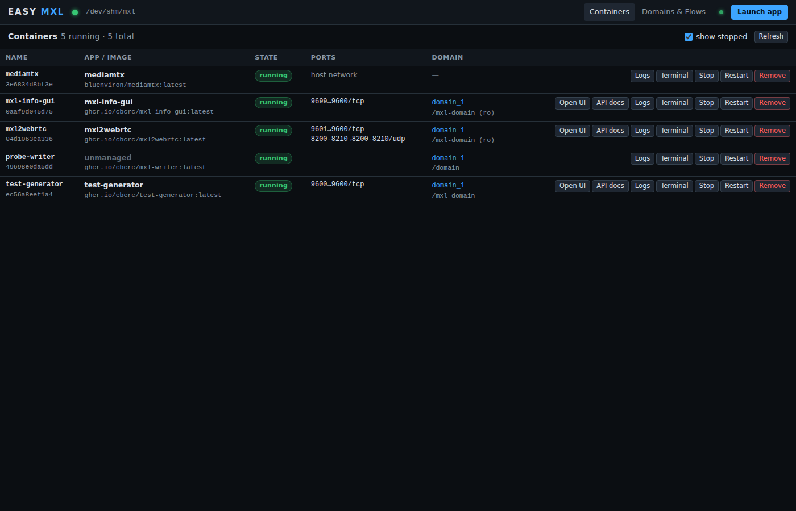

# Getting started

From an empty Ubuntu host to a live MXL flow with a known writer: requirements, three ways to
install, and a first walkthrough.

## Requirements

- **Ubuntu 24.04.** Other recent Linux distributions work; only Linux exposes `/proc/locks`,
  which flow activity detection relies on.
- **Docker Engine** (`docker-ce`) with the daemon running. EASY MXL must be able to open the
  Docker socket: run it as root (the systemd unit does) or as a user in the `docker` group
  (`sudo usermod -aG docker $USER && newgrp docker`). The one-line installer installs Docker
  Engine when it is missing; otherwise follow the
  [Docker docs](https://docs.docker.com/engine/install/ubuntu/) or the hands-on
  [WSL/Ubuntu preparation](https://github.com/cbcrc/mxl-hands-on/blob/main/Preparation/WSL-Ubuntu.md).
- **Node.js >= 20** (22 recommended) - only when you neither use the installer nor the
  container image. Ubuntu's own `nodejs` package is too old; use
  [NodeSource](https://github.com/nodesource/distributions).
- **python3** (optional). MXL timestamps are TAI; with `python3` present EASY MXL reads
  `CLOCK_TAI` for the exact TAI-UTC offset, otherwise it estimates the offset from live flows.
- **Network access to `ghcr.io`** (and Docker Hub for `bluenviron/mediamtx`) for image pulls.
  Behind a corporate proxy configure the *daemon*, not just your shell:
  `/etc/systemd/system/docker.service.d/http-proxy.conf` with
  `Environment="HTTPS_PROXY=http://proxy:3128" "NO_PROXY=localhost,127.0.0.1"`, then
  `systemctl daemon-reload && systemctl restart docker`
  ([Docker docs](https://docs.docker.com/engine/daemon/proxy/)). Some apps also install a
  codec package from the Ubuntu archive on first start (see the
  [catalog notes](apps.md#the-built-in-catalog)).
- **Shared memory size.** `/dev/shm` defaults to 50 % of RAM. A 1080p video flow at the
  default 200 ms history needs roughly 25-30 MB (four times that for 2160p), so the default is
  plenty for a handful of flows. To enlarge it add
  `tmpfs /dev/shm tmpfs defaults,size=16G 0 0` to `/etc/fstab` or run
  `mount -o remount,size=16G /dev/shm`. Alternatively use the hands-on tmpfs mount
  `tmpfs /Volumes/mxl tmpfs defaults,noatime,size=512M,uid=1000,gid=1000,mode=0755 0 0`
  (`EASY_MXL_TMPFS_VOLUMES=1` with the one-line installer, `--tmpfs-volumes` with the
  repository script) and start EASY MXL with `--domain-root /Volumes/mxl`. On WSL 2
  `/dev/shm` may be disk-backed; use the `/Volumes/mxl` mount there.

Default ports: 9700 (EASY MXL),, 9600-9606 and 9699 (app UIs),
8554 / 8889 / 8189-udp (MediaMTX, host network), 8200-8210/udp (MXL to WebRTC direct mode).

## Install

Three routes; pick one.

=== "One-line installer"

    ```sh
    curl -fsSL https://github.com/CLOUDflex-broadcast/easy-mxl/releases/latest/download/install.sh | sudo bash
    ```

    The script installs Docker Engine if it is missing, Node.js 22 if it is missing, and the
    latest release to `/opt/easy-mxl`. It installs a systemd unit that listens on
    `0.0.0.0:9700`, writes `/etc/default/easy-mxl` with a random `EASY_MXL_TOKEN` and prints
    the URL and the token. Keep the token: the web UI asks for it on first use.

    Options are passed as environment variables:

    | Variable | Effect |
    |---|---|
    | `EASY_MXL_VERSION=v0.1.0` | install that release instead of the latest one |
    | `EASY_MXL_TMPFS_VOLUMES=1` | also add the hands-on `/Volumes/mxl` tmpfs entry to `/etc/fstab` and mount it |

    ```sh
    curl -fsSL https://github.com/CLOUDflex-broadcast/easy-mxl/releases/latest/download/install.sh \
      | sudo env EASY_MXL_VERSION=v0.1.0 EASY_MXL_TMPFS_VOLUMES=1 bash
    ```

    To remove the installation again, run the same script with `--uninstall`:

    ```sh
    curl -fsSL https://github.com/CLOUDflex-broadcast/easy-mxl/releases/latest/download/install.sh | sudo bash -s -- --uninstall
    ```

    Every GitHub Release carries `easy-mxl-<version>.tar.gz` (prebuilt: `dist/` plus
    production `node_modules`), `SHA256SUMS` and `install.sh`, so you can also download and
    read the script before running it. See [Deployment](deployment.md) for what the unit
    does and how to change its settings.

=== "From source"

    Needs Node.js >= 20 and Docker on the host.

    ```sh
    git clone https://github.com/CLOUDflex-broadcast/easy-mxl.git easy-mxl
    cd easy-mxl
    npm ci
    npm run build
    npm start                      # = node dist/bin/easy-mxl.js
    ```

    Open <http://localhost:9700>. The server binds to `127.0.0.1` by default; pass
    `--host 0.0.0.0 --token <secret>` to reach it from another machine.
    `node dist/bin/easy-mxl.js --help` lists all flags; see [Configuration](configuration.md).

    Instead of building, you can unpack the prebuilt `easy-mxl-<version>.tar.gz` from a
    [GitHub Release](https://github.com/CLOUDflex-broadcast/easy-mxl/releases) (verify it with
    `sha256sum -c SHA256SUMS --ignore-missing`) and run `node dist/bin/easy-mxl.js` from the
    unpacked directory.

    To run a checkout or an unpacked tarball as a service, use
    `sudo scripts/install-ubuntu24.sh` ([Deployment](deployment.md#with-the-repository-installer)).

=== "Container"

    The image `ghcr.io/cloudflex-broadcast/easy-mxl` is tagged with the release version,
    `major.minor` and `latest`.

    ```sh
    EASY_MXL_TOKEN="$(openssl rand -hex 16)"; echo "token: $EASY_MXL_TOKEN"   # keep it, the UI asks for it
    docker run -d --name easy-mxl --restart unless-stopped \
      --pid=host --cgroupns=host \
      -v /var/run/docker.sock:/var/run/docker.sock \
      -v /dev/shm:/dev/shm \
      -p 9700:9700 \
      -e EASY_MXL_TOKEN="$EASY_MXL_TOKEN" \
      ghcr.io/cloudflex-broadcast/easy-mxl:latest
    ```

    Every flag matters:

    - `-v /var/run/docker.sock:...` gives the container the Docker API; it is root-equivalent
      on the host, so always set a token and publish the port only where you trust the
      network (`-p 127.0.0.1:9700:9700` keeps it local).
    - `-v /dev/shm:/dev/shm` - the domain root must be visible at the **same absolute path**
      inside and outside the container. When EASY MXL launches an app it asks the daemon to
      bind mount `<domain path>`, and the daemon resolves that path on the host. With another
      root (for example `/Volumes/mxl`) mount it at the identical path and set
      `-e EASY_MXL_DOMAIN_ROOT=/Volumes/mxl`.
    - `--pid=host` - `/proc/locks` lists lock holders by PID *as seen from the reader's PID
      namespace*. In an isolated namespace the writer processes of other containers show up as
      PID 0 and cannot be mapped to a container through `/proc/<pid>/cgroup`; sharing the host
      PID namespace makes writer detection work exactly as on the host.
    - `--cgroupns=host` - on cgroup v2 hosts (stock Ubuntu 24.04) a container gets a private
      cgroup namespace, in which `/proc/<pid>/cgroup` of other containers' processes no longer
      contains the `docker-<id>.scope` path; without the host cgroup namespace flows show as
      active but without a writer container name.

    The image is `node:22-alpine` plus `python3` (for the TAI offset) and the production
    dependencies; `EASY_MXL_HOST=0.0.0.0` is preset and port 9700 is exposed. Details and
    caveats in [Deployment](deployment.md#running-easy-mxl-itself-in-docker).

## Your first flow in five minutes

1. **Open EASY MXL.** Browse to `http://<host>:9700`. When a token is configured (the
   installer generates one, the container example sets one) the UI asks for it once and
   stores it in the browser.
2. **Create a domain.** Under **Domains & Flows** create the domain `domain_1` (label and
   buffer depth are optional). EASY MXL creates `/dev/shm/mxl/domain_1` with
   `domain_def.json`, owned by uid 1000 when EASY MXL runs as root so the hands-on writer
   tools can use it too.
3. **Launch the Test Generator.** Click **Launch app**, choose **Test Generator**, select
   `domain_1` and press **Launch**. The image is pulled on first use; progress is shown in
   the dialog.

    

4. **Start the pipeline.** Press **Open UI** on the `test-generator` row. In the Test
   Generator pick the domain under `/mxl-domain`, name the flows and press **Start**.
5. **Watch the flows.** Back under **Domains & Flows** -> `domain_1`, the video and audio
   flows appear as *active* with `test-generator` as writer, a live head index, latency and
   last-write age.

    

From here, launch **MXL Info GUI** (the official `mxl-info` view of the same domain) and / or
**MXL to WebRTC** (MediaMTX is launched automatically as a dependency), press **Open UI**,
pick the flows and watch them in the browser. The whole catalog is described under
[Apps](apps.md); what you are looking at is explained under [How it works](how-it-works.md).
