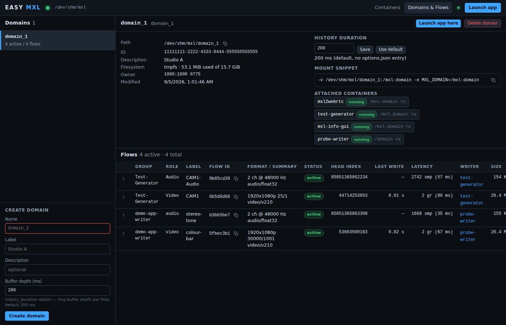

# EASY MXL

**The easiest way to do MXL.**

EASY MXL is an open-source web tool for an Ubuntu Docker host that takes the setup work out of
the EBU Dynamic Media Facility [Media eXchange Layer](https://github.com/dmf-mxl/mxl). It
creates MXL domains in shared memory, launches the DMF-MXL media functions as containers from a
catalog, shows every flow in a domain together with the container that writes it, and puts
container logs and a terminal in your browser. It is one Node.js process with no database,
driven from `http://<host>:9700`.



## What you get

- **Domains in shared memory.** Create an MXL domain on tmpfs, complete with the
  `domain_def.json` and `options.json` the MXL SDK expects, and expose it to containers as a
  bind mount.
- **Every flow, live.** Group, role, label, UUID, format summary, active / inactive / stale
  status, head index, last write age, latency in grains, size on tmpfs - and the container
  that holds the writer lock.
- **The DMF-MXL apps from a catalog.** Test Generator, MXL Info GUI, MXL to WebRTC, File
  Player, HLS to MXL Gateway, Input Selector, HTML5 Keyer, WebRTC to MXL and the hands-on
  writer / reader tools. Images are pulled on demand, MediaMTX is started automatically as a
  dependency, and every app's web UI and Swagger page open with one click.
- **Container control.** Start, stop, restart, kill and remove containers; stream their logs
  (stdout / stderr, tail, timestamps); open a terminal (xterm.js over WebSocket).

## Install

On an Ubuntu 24.04 host with sudo:

```sh
curl -fsSL https://github.com/CLOUDflex-broadcast/easy-mxl/releases/latest/download/install.sh | sudo bash
```

The installer adds Docker Engine and Node.js 22 when they are missing, puts the latest release
in `/opt/easy-mxl`, installs a systemd unit listening on `0.0.0.0:9700`, writes a random API
token to `/etc/default/easy-mxl` and prints the URL and the token. Open the URL, paste the
token, create a domain and launch the Test Generator.

- [Getting started](getting-started.md) - requirements, the three install routes and your
  first flow in five minutes.
- [How it works](how-it-works.md) - what a domain is on disk, how flows and their writers are
  detected and how latency is computed.

EASY MXL is licensed under MIT. It is not affiliated with the MXL project or
CBC/Radio-Canada; the DMF-MXL images and the MXL SDK are the work of
[dmf-mxl/mxl](https://github.com/dmf-mxl/mxl) and
[cbcrc/mxl-hands-on](https://github.com/cbcrc/mxl-hands-on).
